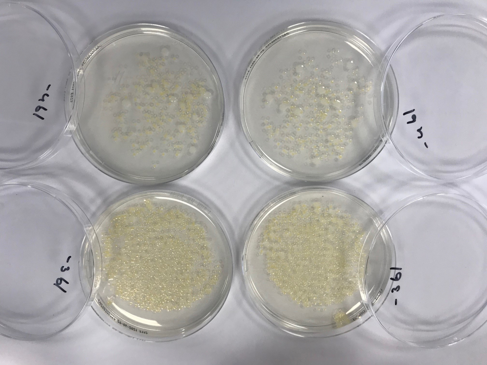
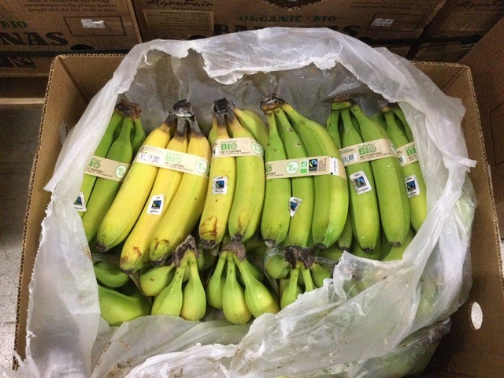
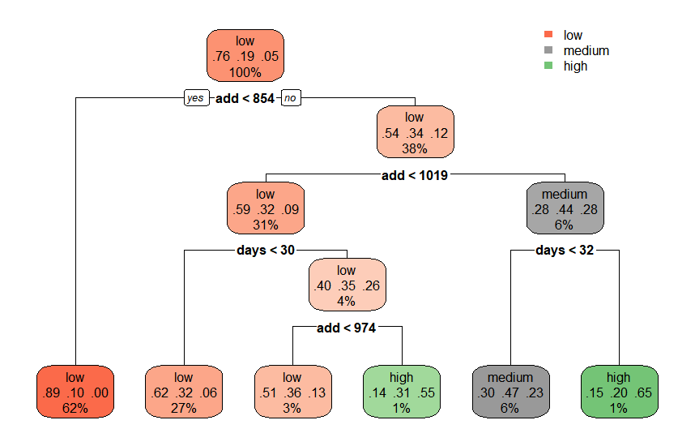

```{r setup, include=FALSE, warnings = FALSE}
knitr::opts_chunk$set(warning = FALSE, message = FALSE) 
library(readxl)
library(tidyverse)
library(curl)
library(httr)
library(reshape2)
library(broom)
library(caret)
library(readr)
library(lubridate)
library(ggthemes)
library(formattable)
library(nnet)
library(skimr)
library(formattable)
library(rattle)
options(knitr.table.format = "latex")

```

# Abstract {-}
**Organic bananas are grown without synthetic fertilizer or chemical pesticides. This is better for the environment and the health of consumers and banana workers. However, it makes export banana more susceptible to post-harvest decay, especially during the long (2-4 weeks) transit time in refrigerated containers to European markets. A notable form of post-harvest decay is rot of the cutting surface of the banana cluster, known as crown rot. Professionals in the industry have observed that the incidence of crown rot is associated with the time of the year and have the experience that the use of controlled atmosphere (CA) containers (with reduced O~2~ and increased CO~2~ content) can reduce the development of crown rot. In this article, I present an analysis of the problem based on a curated proprietary dataset with almost 7000 real shipments of organic bananas from Latin America to Europe over a time frame of more than 4 years. The analysis is performed by collecting historic weather data from a local weather station and analyze if weather has an association with the phenomenon. I conclude that this seems to be the case. I show that CA mitigates the problem when the growing temperature sums are higher and the transit time (residence time in container) longer. I develop machine learning models that can reasonably successfully predict the incidence of crown rot on future shipments. This allows to make informed decisions on whether or not to deploy CA based on cost-benefit analysis. A number of classification algorithms is tested. As the dataset is imbalanced, it requires synthetic sampling to achieve a good balance of accuracy over three prediction classes** 

\tableofcontents

# Introduction
## Background of the problem
Organic bananas are grown without synthetic fertilizer or chemical pesticides. This is better for the environment and the health of consumers and banana workers. However, it makes export banana more susceptible to post-harvest decay, especially during the long (2-4 weeks) transit time in refrigerated containers to European markets. A notable form of post-harvest decay is rot of the cutting surface of the banana cluster, known as crown rot. The rot is caused by a complex of patheogenic funguses and bacteria, notably *Lasiodiplodia theobromae*, *Colletotrichum musae* and a complex of *Fusarium spp.*[@Alvindia2008].

{width=300px}

The crown rot phenomenon causes considerable economic damage to the industry. It is a latent defect, meaning it cannot be detected during packaging. When the fruit is packed and stowed in a refrigerated container, the external appearance of the fruit is clean and green. Only during the sea voyage, under some poorly known conditions, the disease comes to development. It is only detected on arrival, when every container is subject to a rigorous quality control. The disease only develops to its fullest extent after ripening. Bananas are supposed to arrive green and unripe, and become ripe and edible only after 5-7 days ripening at slightly elevated temperature (18°C) under addition of a trace of ethylene gas, which is a plant ripening hormone. In light to moderate cases, it causes the rejection and wastage of a certain percentage of the fruit. In severe cases, it can lead to a significant reduction of the value of the cargo, and even infect healthy fruit because the affected bananas start to ripen and emit ethylene gas, which is a trigger for banana ripening. This means a loss to the producer of the fruit and also a reduction of the supply reliability to the customer. It is therefore important to detect and reduce the disease, if possible. 

{width="75%"}

{width="75%"}

Professionals in the industry have observed that the incidence of crown rot is associated to a seasonal pattern and have the experience that the use of controlled atmosphere (CA) containers (with reduced O~2~ and increased CO~2~ content) can reduce the development of crown rot [@Lassois2014] [@Wade1993].
The objective of this paper is to analyze factors associated with crown rot and its prevention or mitigation, and to develop a predictive model using machine learning algorithms. Predicting the crown rot risk before shipment of the consignment allows a trader to decide to ship in CA containers to reduce the risk or advise any other acceptable treatment that may reduce the risk. As crown rot is a latent defect that only develops over time, prediction is important. Because CA comes at at significantly higher cost, it is undesirable to ship all consignments under CA. 

## Dataset and experimental design
To achieve the objective, I use a proprietary dataset of almost 7000 data points consisting of real life quality survey data of as many container shipments of organic bananas from 2016 to the present. The raw dataset has many variables, such as producer, shipping line, port of destination. However, for the sake of simplification and anonymization, the dataset has been reduced to the most important variables, notable the packing date, the transit time and whether or not a CA container has been employed. The data is an excerpt of a larger dataset of over 20,000 rows. The data cleaning and preparation has been done outside this project, because of the proprietary nature of the data. 
In addition to the quality data, I need weather data. This are retrieved from meteostat.org. This is an open source platform that makes historic weather data availble for many locations. 

{width=500px}

# Analysis
## Description of the dataset

```{r read}
#READING QUALITY AND SHIPMENT DATA 
data <- read.csv("data.txt")
data <- data %>% select(-X) %>% mutate(dd = as.Date(dd), ca = as.factor(ca), 
                                       pd = as.Date(pd))
```
The structure of the dataset is as follows:

```{r descriptive}
summary(data)

```
ca    : dummy variable indicating if consignment is carried under controlled atmosphere
pd    : pack date (a few days before date of departure of vessel)
dd    : discharge date (date of opening the container in Europe)
X     : a sequential number or row ID without meaning  
days  : the transit time, the time between pack date and date of discharge
CR    : the percentage of crown rot (mild)
CRC   : the percentage of crown rot (heavy)
C     : the summed and weighted composite crown rot percentage (CR + 2 * CRC)

The table shows that there are no missing variables in the dataset. There are more pack dates than discharge dates. This can be understood, because the packing takes more time. Some days before the ship's departure are used to pack. On arrival, multiple  containers are discharged on the same date.
The average transit time is 27.4 days. The mean of CR and CRC are both below 1% (0.01). A composite crown rot percentage has been created attaching double weight to heavy crown rot. This is arbitrary. This data can be used as regression problem, or when crown rot percentages are transformed in classes, as a classification problem. Before  developing such models, we first need to retrieve, process and attach weather data to this dataset. This is a separate task. Then we can analyze the data.

## Retrieving weather data
Professionals in the industry have observed a seasonal pattern in the crown rot incidence. The following boxplot of crown rot incidence per pack date month shows that this is also the case in the data. The month of April clearly has the highest incidence.The data has been plotted for CA and non-CA separately and seems to indicate that there is a marked difference in incidence.

```{r graph1, echo=FALSE, fig.cap='Boxplot of crown rot incidence per month', out.width = "90%", fig.align = "center"}
#make a plot of average CR incidence per despatch month
data %>% mutate(week = strftime(pd, format = "%V"), 
month = strftime(pd, format = "%m")) %>% 
  ggplot(aes(month, C*100, col = ca)) +
  geom_boxplot() +
    scale_x_discrete(name = "month") +
    scale_y_continuous(name = "crown rot per month average %") +
    theme(axis.title.y = element_text(color = "grey"),
          axis.title.y.right = element_text(color = "blue")) +
    theme_few()
```

The seasonal pattern points in the direction of a weather related influence. For this reason, it is necessary to collect historic weather data. This can be retrieved from the application programming interface (API) of meteostat.org. The weather station closest to the banana plantations was station 84401 (Piura in Peru). The following code downloads the weather data from the API. The variable structure is appended from the "weather-structure".csv" file that I had constructed. Finally, only the date and temperature columns are retained. The precipitation field had been desirable, but this contained too many missing values to be useful. Moreover, the climate of Piura is very dry, with only 52 mm of rainfall per year. The water requirements of bananas are met by irrigation. Besides, the literature indicates that rainfall or humidity do not play a significant role [@Lassois2010].   

```{r weather}
#create a function for reading weather from meteostat API:

read_weather <- function(station){
  url <- paste("https://bulk.meteostat.net/hourly/",station,".csv.gz", sep= "")
  tempdir()
  tmp <- tempfile()
  curl_download(url, tmp)
  download.file(url, destfile = paste(station, ".wd", sep=""))
}

#define weather station of choice: 84401
station <- 84401


#read the weather from meteostat:84401
read_weather(station) #this function downloads the data in compressed form

#collect the data structure of weather report 
names <- read.csv("weather-structure.csv", header=FALSE, sep=";")
vars <- unlist(names$V2)
type <-unlist(names$V3)

weather <- read.csv(paste(station, ".wd", sep = "")) 
#read and decompress the weather file
names(weather) <- vars # attach understandable variable names to the columns

# select the variables to be used and mutate some new variables

W_PE <- weather %>% select(date, temp) %>%
  mutate(date = as.Date(date))

summary(W_PE)
```

##Processing weather data

Next, I plot the weather data after I have calculated the mean temperatures per day (they are recorded 4-12 times per day).

```{r graph2, echo=FALSE, fig.cap="A plot of the mean temperatures per date for Piura, Peru", out.width = "80%", fig.align = "center"}
# make a dataframe with mean temperature per day
summ_PE <- W_PE %>% 
  group_by(date) %>%
  summarise(mean_temp = mean(temp, na.rm = TRUE)) # 

# make a graph of mean temperature against date
summ_PE %>% filter(date > "2016-01-01") %>%
  ggplot(aes(date, mean_temp)) +
  geom_line() +
  ggtitle(label  = "Average daily temperature Piura") +
  ylab('Temperature °C')+ xlab('date') +
  theme(text = element_text(size=8),
        axis.text.x = element_text(angle=0, hjust=1)) +
  theme_few()
```
It is customary in agriculture to relate the development of crops to temperature sums: the temperature sum is the integral of the mean daily temperature above a certain crop-specific floor temperature over the time. The temperature sum is expressed as degree.days. In the case of bananas, the floor temperature is 13.5 °C. This is the temperature below which the banana plant does not grow. Not accidentally, it is also the temperature at which bananas are carried in refrigerated containers. At this temperature, the plant metabolism is reduced to the minimum. Below this temperature, the plant will die, viz. the bananas will be damaged by cold shock [@Chillet2006], [@Ganry1975]. The degree.days are a parameter that is used to determine when a crop is ready to be harvested. In the banana industry in Peru, this is not done in this way, especially because the water supply by irrigation is a limiting factor to growth. Normally, bananas are harvested 10-12 weeks after flowering. For that reason I calculate the accumulated degree.days for a set time span of 10 weeks for every single pack date. This could also be 11 or 12, but this is not expected to change much. The results are plotted in a line plot, which shows that the rolling summation has a smoothing effect.The plot now indicates how many degree.days a bunch of bananas has received after a 10 week growing cycle.  


```{r degreedays}
#formula to calculate the cumulative sums based on span and cut-off of 13.5°C
span <- 10
summ_add_PE <- summ_PE %>% filter(date >=  (as.Date("2016-01-01")-span*7)) %>% 
  mutate(grow_temp = (mean_temp - 13.5), cdd = cumsum(grow_temp)) %>% 
  #the grow temperature is the temperature above 13.5°C under which temperature 
  #bananas do not grow but die
  mutate(add = cdd - lag(cdd, span*7)) %>% 
  # the accumulated degree.days or temperature sum is calculated for every day 
  #from the cumulative grow_temp
  na.exclude() #exclude rows with NaN
```

```{r graph3, echo=FALSE, fig.cap="Plot of accumulated degree.days per date for Piura, Peru.", out.width = "90%", fig.align = "center"}
# for control, make a plot of accumulated degree days against date
summ_add_PE %>%
  ggplot(aes(date, add)) +
  geom_line() + 
  ylab('Accumulated degree.days °C.day')+ xlab('date') +
  theme(text = element_text(size=10),
        axis.text.x = element_text(angle=0, hjust=1)) 
```
The next step is now to join the calculated accumulated degree days to the quality dataset.

```{r join}
# join the quality data to the weather data to have a list of quality data with
#ADDs for every shipment.
data_PE <- data %>% left_join(summ_add_PE, by = c('pd' = 'date')) 
```

We can now proceed to the exploratory data analysis.

# Exploratory data analysis

Now that we have accumulated degree.days, it is possible to plot the incidence of crown rot against the degree.days and see if there is any association between the two.

```{r add_plot, echo=FALSE, fig.cap="Accumulated degree days and crown rot.", out.width = "90%", fig.align = "center"}
# make an overlay plot of ADD  and crown rot
ggplot() + 
  geom_line(data=summ_add_PE, aes(x=date, y=add), color='blue') + 
  geom_point(data=data_PE, aes(x=pd, y=C*2000), color='purple', alpha = 0.5)+
  scale_x_date(name = "date", labels = date) +
  scale_y_continuous(name = "temperature sum °C.day", 
                     sec.axis = sec_axis(~./100, name = "crown rot", 
                          labels = function(b) { paste0(round(b, 0), "%")})) +  
  theme(axis.title.y = element_text(color = "grey"),
        axis.title.y.right = element_text(color = "blue")) +
  theme_few()
```
The plot clearly shows that the crown rot incidence follows the weather pattern. Moer particularly, it increases with rising temperature sums. Apparently, the fruit becomes more vulnerable to fungal attack at the cutting faces when it has had more growing days. Perhaps this means that the physiological age of the fruit is older, in spite of the fact that the thickness of the fruit is not bigger (this conclusion cannot be drawn from the data though).

Now I want to explore any association between crown rot, degree.days and the use of CA containers. For that purpose, I plot the data in a heat map. The transit times and the degree.days are gatherd in bins.

```{r bins}
#make a heatmap of crown rot versus transit time (days) and ADD 
#define bins
lbl_days <- c("11-20", "21-30", "31-40", "41-50", "51-60", "61-70")

lbl_add <- c("401-500", "501-600", "601-700", "701-800", "801-900",
             "901-1000", "1001-1100","1101-1200")

#compute averages per bin
data_hm_PE <- data_PE %>% drop_na(add) %>% mutate(day_bins = cut(days, 
              breaks = seq(10, 70, 10), include.lowest = FALSE, label = lbl_days), 
              add_bins = cut(add, breaks = seq(400,1200, 100), 
              include.lowest = FALSE, label = lbl_add)) %>%
  group_by(day_bins, add_bins, ca) %>%
  dplyr::summarize(CR_avg = mean(C), n = n())
```
```{r, heatmap, echo=FALSE, fig.cap="A heatmap of crown rot against ADD and transit time(days).", out.width = "90%", fig.align = "center"}
#make geom_tile plot
p2 <- data_hm_PE %>%
  ggplot(aes(x = day_bins, y = add_bins)) +
  geom_tile(aes(fill = CR_avg*100)) + 
  scale_fill_gradient2(low = "white", high = "blue", 
                       midpoint = 1, 
                       breaks = seq(0, 20, 5), 
                       limits = c(0, 20)) +
  labs(title="crownrot versus ADD and transit time",
       x ="transit time (days)", y = "temperature sum (degree.days)", 
       subtitle = "figures indicate number of shipments") +
  labs(fill = "Avg crown rot %") +
  geom_text(aes(label = n), size = 2) +
  theme(text = element_text(size=10),
        axis.text.x = element_text(angle=0, hjust=1)) + 
  facet_grid(. ~ ca)
p2 + theme(plot.subtitle=element_text(size=8, hjust=0, face="italic", color="black"))
```
The plot shows the average crown rot percentage per bin, split over with and without CA. The numbers indicate the number of shipments in the bin.  The figures shows nicely that crown rot incidence increases with a degree.days and transit time increasing in combination. The use of CA seems to have a mitigating influence on the development of crown rot. To analyse these correlations more formally, we make a correlation matrix of the variables.

```{r cormat}
#explore correlation between variables

#make a correlation matrix
source("corstars.R") #this retrieves the function created by ....

data_PE %>% select(C, add, days, ca) %>% mutate(CA = as.numeric(ca)) %>% select(-ca) %>%
  drop_na() %>% corstars(.) %>% knitr::kable(caption = "Pearson correlation matrix")
```
The Pearson correlation table shows that there are significant correlations between crown rot percentage and degree.days, transit time and use of CA, but that these are generally weak (<0.5).

Before planning a machine learning approach, I first convert the crown rot percentage to a class variable. It is more practical to know if the risk of developing crown rot is low, medium or high, than to predict a percentage. For professionals, a low risk means no action, a medium or high risk could mean that it is sensible to apply a CA container or be prepared for crown rot damage. I use therefore two aforementioned classes, with cut-offs at 0.5% for medium and 5% for high. The following code creates the data for the machine learning. The table produces descriptive statistics. 

```{r class}
#Create a categorical variable for CR risk"(low/medium/high:
data_ML <- data_PE %>% select(ca, days, C, add, pd) %>% 
  mutate(C_risk = cut(C, breaks = c(0,0.005, 0.05, 1), 
                      include.lowest = TRUE,
                      labels = c("low", "medium",  "high")),
         ca = as.factor(ca)) %>%
  select(-C)

#make a descriptive statistics table to inspect the data
library(skimr)
summary(data_ML)


```
The table shows us some important information: First there are no missing observations. Second, the dataset is imbalanced in the classes. That means that there are many "no" observations, and fewer "medium" and "high" observations. This influences the machine learning results as we shall see.

# Machine learning results

## Data partitioning
I partition the data in three sets: a train and a test set and a final hold-out validation set. The validation set contains the data for 2021. Every data row is a shipment of which I want to predict the crown rot risk, in order to decide whether to ship it under CA or not. The previous years serve as train and test set, with the aim of doing meaningful predictions on the current season.

```{r partitioning}

#splitting the data in a train and a test set and a hold-out set for validation
validation <- data_ML %>% filter(pd >= "2021-01-01") %>% select(-pd) %>% 
  mutate(ca = as.integer(ca))
traintest <- data_ML %>% filter(pd < "2021-01-01") %>% drop_na() %>% 
  select(-pd) %>% mutate(ca = as.integer(ca))

#create a data partition
set.seed(1, sample.kind = "Rounding")
trainIndex <- createDataPartition(traintest$C_risk, p = .5, 
                                  list = FALSE, 
                                  times = 1)

train <- traintest[trainIndex,]
test <- traintest[-trainIndex,]

```

## Pre-processing and tune controls
The data are automatically scaled and centered by using the "preProcess = c("center", "scale")" feature of the train command in the caret package.
The tune control features of caret are used to automatically determine the optimal tuning setting, such as the k for the k nearest neighbours, the mtry for the random forest and the complexity parameter to prune the trees in the decision tree.

## A first machine learning test  model 
With this data, I try a first machine learning model to get an idea of the performance. This is a recursive partitioning decision tree model, which also allows to nicely visualize the model.The complexity parameter cp is set in such a way that the model is pruned to just a few branches, to ensure a sufficiently abstract model and avoid overfitting. Automatic 10-time cross-validation is applied.

```{r knn}
# train a decision tree for test
library(rpart)
set.seed(2, sample.kind = "Rounding")
model1 <- train(C_risk ~ ., data = train, 
                method = "rpart",
                preProcess = c("center", "scale"),
                tuneLength = 10,
                trControl = trainControl(method = "cv"))

y_hat <- predict(model1, newdata = test)
cfm_r <- confusionMatrix(y_hat, test$C_risk, dnn = c("Prediction", "Reference"))
cfm_r
```
```{r dec_tree, fig.cap="Decision tree."}
#visualize the decision tree
library(rpart.plot)
set.seed(3, sample.kind = "Rounding")
model.rpart1 <- rpart(C_risk ~ ., data = train, method = "class",
                      control = rpart.control(cp = 0.01))
#rpart.plot(model.rpart1, box.palette = "auto")
```
{width=500px}

The contingency table shows that the prediction has an accuracy of `r round(cfm_r$overall[1], 2)`.The table shows however that the sensitivity is high, in other words, it is capable of predicting true positives ("low") well, but the sensitivity is low, it is not good at predicting true negatives ("medium"'s and "high"'s). It is especially not good at predicting "medium"'s. The decision tree is informative: it gives the decision rules for deciding the probability of an observation falling in one of the classes.
The probability of predicting lows is good, with good sensitivity (TP/(TP+FN)), but there are too many missed mediums and highs or false negatives. The specificity is high ( TP / (TN + FP)). Missing these is costly.A reason for the poor predictive capability of the positives (the mediums and highs) is that the dataset is imbalanced. There are many "low" values (majority class) and few "medium" and "high" (minority class) and this biases the algorithm towards predicting lows.

## Dealing with an imbalanced dataset

To addres the imbalance, I will make use of synthetic minority oversampling technique (SMOTE) [@Chawla2002]. It means that the algorithm artificially generates more minority observations using a distance-based algorithm. It can also randomly reduce majority class observations, to produce a balanced dataset where all classes have equal proportions. I use the smotefamily package in R on the train dataset. I reduce the majority class by 0.5 and increase the minority classes by 2 and 7 respectively. 
```{r smote}
library(UBL)
train.smote <- SmoteClassif(C_risk ~ ., train, list("low"=0.5, "medium" = 2, 
            "high"=7), k = 5, repl = FALSE, dist = "Euclidean")

#the table show the dataset is now balanced over the classes 
#(using under and oversampling)
table(train.smote$C_risk)
summary(train.smote)
```
## Testing the balanced dataset
The SMOTE-balanced dataset is now used to train the decision tree again. and display the decision tree. 

```{r balanced rpart}
# test the smoted dataset on the decision tree:
model_rpart <- train(C_risk ~ ., data = train.smote, 
                method = "rpart",
                preProcess = c("center", "scale"),
                tuneLength = 10,
                trControl = trainControl(method = "cv"))

y_hat_rpart <- predict(model_rpart, newdata = test)
cfm_rpart <- confusionMatrix(y_hat, test$C_risk, 
                             dnn = c("Prediction", "Reference"))
cfm_rpart
``` 
```{r dec_tree_2, fig.cap="Decision tree for SMOTEd dataset"}
#we can visualize the decision tree
library(rpart.plot)
#we can use priors of the distribution to improve the model and define 
#minimum splits to reduce detail
model.rpart2 <- rpart(C_risk ~ ., data = train.smote, method = "class", 
                      parms = list(split = "ca"),
                      control = rpart.control(cp = 0.01))
rpart.plot(model.rpart2, box.palette = "auto")
```
The confusion matrix of the algorithm applied to the balanced dataset shows that the accuracy was reduced from `r cfm_r$overall[1]` to `r cfm_rpart$overall[1]`, but that the kappa value changed from `cfm_r$overall[2]` to `r cfm_rpart$overall[2]`. The kappa value is a measure of how well the algorithm is better capable of indicating the performance of the algorithm. It removes the possibility of the algorithm making a correct random guess.

The decision tree gives interesting information about the probabilities of an observation ending up in one of the classes, depending on decision parameters, such as accumulated degreedays, transit time and use of CA. It shows that the use of CA tends to reduce a high risk to a medium or low risk in situations where the accumulated degreedays are higher than  968 and the transit time is less than 30 days. This conforms to the heatmap of Figure \@ref(fig:heatmap). 
## Various classification algorithms algorithms

With the synthetic balanced dataset, I will now experiment with a number of classification algorithms and compare these with each other. 

```{r models, include=FALSE, warning = FALSE}
# train a  k-nearest neighbour model on smote dataset
set.seed(2, sample.kind = "Rounding")

model_knn <- train(C_risk ~ ., data = train.smote, 
                method = "knn",
                preProcess = c("center", "scale"),
                tuneLength = 10,
                trControl = trainControl(method = "cv"),
                tuneGrid = expand.grid(k = c(2, 5, 11)))
model_knn
y_hat_knn <- predict(model_knn, newdata = test)
cfm_knn <- confusionMatrix(y_hat_knn, test$C_risk, 
                           dnn = c("Prediction", "Reference"))

# train a multinomial generalized linear model/neural network
set.seed(1, sample.kind = "Rounding")
library(glmnet)
myControl <- trainControl(
  method = "cv", number = 10,
  classProbs = TRUE # Super important!
)

myGrid <- expand.grid(
  alpha = 0:1,
  lambda = seq(0.0001, 1, length = 20)
)
# Fit a model
set.seed(33)
model_glmnet <- train(C_risk ~ ., data = train.smote,  
                method = "glmnet", 
                tuneGrid = myGrid,
                trControl = myControl)

#Check the model
model_glmnet
y_hat_glmnet <- predict(model_glmnet, newdata = test)
cfm_glmnet <- confusionMatrix(y_hat_glmnet, test$C_risk, 
                              dnn = c("Prediction", "Reference"))

# train a support vector machine linear model

model_svm <- train(C_risk ~ ., data = train.smote, 
                method = "svmLinear",
                tuneGrid = expand.grid(C = seq(0, 2, length = 20)),
                preProcess = c("center", "scale"),
                trControl = trainControl(method = "cv"))

y_hat_svm <- predict(model_svm, newdata = test)
cfm_svm <- confusionMatrix(y_hat_svm, test$C_risk, 
                           dnn = c("Prediction", "Reference"))

# train a  neural network
set.seed(2, sample.kind = "Rounding")
model_nnet <- train(C_risk ~ ., data = train.smote, 
                method = "nnet",
                preProcess = c("center", "scale"),
                trControl = trainControl(method = "cv"))
model_nnet
y_hat_nnet <- predict(model_nnet, newdata = test)
cfm_nnet <- confusionMatrix(y_hat_nnet, test$C_risk, 
                            dnn = c("Prediction", "Reference"))

# train a  treebag
set.seed(2, sample.kind = "Rounding")
model_treebag <- train(C_risk ~ ., data = train.smote, 
                 method = "treebag",
                 preProcess = c("center", "scale"),
                 trControl = trainControl(method = "cv"))
model_treebag
y_hat_treebag <- predict(model_treebag, newdata = test)
cfm_treebag <- confusionMatrix(y_hat_treebag, test$C_risk, 
                               dnn = c("Prediction", "Reference"))

# train a random forest model
#10 folds repeat 10 times
control <- trainControl(method='repeatedcv', 
                        number=10, 
                        repeats=10)
#Metric compare model is Accuracy
metric <- "Accuracy"
set.seed(123)

#Number random variable selected is mtry
mtry <- 2
tunegrid <- expand.grid(.mtry=mtry)
model_rf <- train(C_risk ~., 
                data=train.smote, 
                preProcess = c("center", "scale"),
                method='rf', 
                metric='Accuracy', 
                tuneLength  = 4, 
                trControl=control)
print(model_rf)

y_hat_rf <- predict(model_rf, newdata = test)
cfm_rf <- confusionMatrix(y_hat_rf, test$C_risk, 
                          dnn = c("Prediction", "Reference"))


# train an rda
set.seed(2, sample.kind = "Rounding")
model_rda <- train(C_risk ~ ., data = train.smote, 
                       method = "rda",
                       preProcess = c("center", "scale"),
                       trControl = trainControl(method = "cv"))
model_rda
y_hat_rda <- predict(model_rda, newdata = test)
cfm_rda <- confusionMatrix(y_hat_rda, test$C_risk, 
                           dnn = c("Prediction", "Reference"))

# train a multilayer perceptron
set.seed(2, sample.kind = "Rounding")
model_mlp <- train(C_risk ~ ., data = train.smote, 
                      method = "mlp",
                      preProcess = c("center", "scale"),
                      trControl = trainControl(method = "cv"))
model_mlp
y_hat_mlp <- predict(model_mlp, newdata = test)
cfm_mlp <- confusionMatrix(y_hat_mlp, test$C_risk, 
                           dnn = c("Prediction", "Reference"))
```

The models take a while to calculate on an average laptop computer. After the calculation, the results are collected in a dataframe.
```{r results}
# make a table of the results of the models

results_models <- data.frame(cfm_knn$overall, cfm_mlp$overall, cfm_nnet$overall, 
                             cfm_rda$overall, cfm_rf$overall, cfm_rpart$overall,
                             cfm_svm$overall, cfm_treebag$overall, 
                             cfm_glmnet$overall)
algo_names <- c("k-nearest neighbors", "multilayer perceptron", "neural network", 
                "regularized discriminant analysis", "random forest",
           "recursive partitioning & regression trees", "support vector machine", 
           "bootstrap aggregated tree", "generalized linerar model")
results_models<- results_models[1:2,]
colnames(results_models) <- algo_names

df <- cbind(parameter = rownames(results_models), as_tibble(results_models)) %>% 
  pivot_longer(cols = -"parameter", names_to = c("algorithm"), 
  values_to = "value")
```

The results are plotted in two graphs, one for Accuracy and one for the kappa value.

```{r result_plot1, fig.cap="Results of classification algorithms: Accuracy", echo=FALSE, out.width = "80%", fig.align = "center"}
p3 <- df %>% filter(parameter == "Accuracy") %>% 
  ggplot(aes(reorder(algorithm, value), value)) +
                geom_bar(stat = "identity",  fill = "#FF6666") +
    scale_x_discrete(name = "Accuracy") +
  scale_y_continuous(name = "value") +
  theme(axis.title.y = element_text(color = "grey"),
        axis.title.y.right = element_text(color = "blue")) +
  theme_few() 
p3 + theme(axis.text.x = element_text(angle = 90, vjust = 0.5, hjust=1)) + 
coord_flip()
```

```{r result_plot2, fig.cap="Results of classification algorithms: Kappa", echo=FALSE, out.width = "80%", fig.align = "center"}

p4 <- df %>% filter(parameter == "Kappa") %>%
  ggplot(aes(reorder(algorithm, value), value)) +
  geom_bar(stat = "identity",  fill = "#FF6666") +
  scale_x_discrete(name = "kappa") +
  scale_y_continuous(name = "value") +
  theme(axis.title.y = element_text(color = "grey"),
        axis.title.y.right = element_text(color = "blue")) +
  theme_few() 
p4 + theme(axis.text.x = element_text(angle = 90, vjust = 0.5, hjust=1)) + coord_flip() +
theme_few()
```

```{r F1, fig.cap="F1 values per class of the algorithms", echo=FALSE, out.width = "100%", fig.align = "center"}
F1_models <- data.frame(cfm_knn[["byClass"]][ , "F1"], 
                        cfm_mlp[["byClass"]][ , "F1"], 
                        cfm_nnet[["byClass"]][ , "F1"], 
                        cfm_rda[["byClass"]][ , "F1"], 
                        cfm_rf[["byClass"]][ , "F1"], 
                        cfm_rpart[["byClass"]][ , "F1"],
                        cfm_svm[["byClass"]][ , "F1"], 
                        cfm_treebag[["byClass"]][ , "F1"], 
                        cfm_glmnet[["byClass"]][ , "F1"])
colnames(F1_models) <- algo_names


df2 <- cbind(class = str_remove(rownames(F1_models), pattern = "Class: "), as_tibble(F1_models)) %>% 
  pivot_longer(cols = -"class", names_to = c("algorithm"), values_to = "value") 

p6 <- df2 %>%  arrange(class) %>%
  ggplot(aes(algorithm, value, fill = class)) +
  geom_col(position = "dodge") +
  scale_x_discrete(name = "F1-value") +
  scale_y_continuous(name = "value") +
  theme(axis.title.y = element_text(color = "grey"),
        axis.title.y.right = element_text(color = "blue")) +
  theme_few() 
p6 + theme(axis.text.x = element_text(angle = 90, vjust = 0.5, hjust=1)) + coord_flip() 
```

The first two Figures show that different algorithms have different performances. The accuracy is generally not impressive. This is in part due to the choice for a three-class dependent variable. It is also due to incomplete predictors, introducing quite some residual error into the model. In the extended dataset, there are more predictor variables, like producer, measured fruit size, shipping line and arrival temperature. In some cases, it is known that an instance classified as "CA" is in fact a non-CA when the CA feature was ordered, but had not functioned properly.

The third Figure shows the F1-value (the harmonic mean of precision and recall) per class for the various algorithms. Here we see the still large imbalance between the low, and medium and high classes, respectively, where also the neural network has the marginally best performance.

## Final hold-out test.

The validation sample that was kept behind, is now used for the final hold-out test on the best performing algorithm (judged by kappa).

```{r holdout}
# final hold out test on validation sample with neural network
# 
y_hat_nnet_v <- predict(model_nnet, newdata = validation)
cfm_nnet_v <- confusionMatrix(y_hat_nnet_v, validation$C_risk, 
                              dnn = c("Prediction", "Reference"))
cfm_nnet_v
confusion_matrix <- as.data.frame(table(pred = y_hat_nnet_v, 
                                        ref = validation$C_risk))
```

The following graph visualises the confusion matrix:
```{r cfm, fig.cap="Heatmap of confusion matrix on the neural network model on final hold-out sample.", echo=FALSE, out.width = "70%", fig.align = "center"}
p5 <- ggplot(data = confusion_matrix, 
       mapping = aes(x = pred,
                     y = ref)) +
  geom_tile(aes(fill = Freq)) +
  geom_text(aes(label = sprintf("%1.0f", Freq)), vjust = 1) +
  scale_fill_gradient(low = "light blue",
                      high = "purple") +
  scale_x_discrete(name = "Prediction") +
  scale_y_discrete(name = "Reference") +
  theme_few() 
p5
```
Figure \@ref(fig:cfm) visualizes the confusion matrix. The model on a real sample achieves an accuracy of `r cfm_nnet_v$overall[1]` and a kappa value of `r cfm_nnet_v$overall[2]`. This is perhaps not impressive, but better than a random guess with an estimated accuracy of about 0.33 (3 classes). Besides, it is important that highs are as much as possible classified as highs, and not as lows, but if it is classified as a medium, it is less problematic. Of course, one could argue, that in that case it would be more logical to design it as a two-class problem. However, I have chosen for this approach to achieve a balance between reasonable accuracy of predicting mediums and highs, and not missing too many, as they can come with high costs, on the one hand, as well as not classifying lows incorrectly as medium or high and having to bear the additional cost of 1000 USD per container for operating under CA. If the economic relation between medium and high CR incidence was clearer, this could help inform such a decision. 

Finally, it is interesting to know if the choice for balancing the data really results in a better prediction when using the selected algorithm. I do this by training a model on the imbalanced dataset, and applying to the validation set.
```{r final, include=FALSE}
# train a neural network on the imbalanced set for comparison
set.seed(2, sample.kind = "Rounding")
model_nnet_t <- train(C_risk ~ ., data = train, 
                     method = "nnet",
                     preProcess = c("center", "scale"),
                     trControl = trainControl(method = "cv"))
model_nnet_t
y_hat_nnet_t_v <- predict(model_nnet_t, newdata = validation)
cfm_nnet_t <- confusionMatrix(y_hat_nnet_t_v, validation$C_risk, 
dnn = c("Prediction", "Reference"))
cfm_nnet_t
```

The confusion matrix shows that indeed, using the unbalanced dataset results in the feared effect: a high accuracy on the low class, but a very poor accuracy on the medium and high classes.

# Conclusion
In this report, I have analyzed the incidence of the phytosanitary problem of crown rot on organic bananas. This problem has a seasonal appearance, and seems to be related to the weather, especially the temperature and the duration of transport in refrigerated containers. The use of a controlled atmosphere is also of influence.
For the analysis, I used a proprietary dataset of `r nrow(traintest)` instances of real banana shipments over a few years. A visual exploration of the data showed that there was indeed an association of  crown rot with temperature or rather accumulated degree days, a measure often used in agriculture to calculate the physiological development of crops. The dataset was split into three classes, defining low, medium and high incidence. The dataset was imbalanced, in that there were many more instances of low than of the other classes. This makes training a model difficult, in that it biases the model towards the most frequent class. The accuracy for this class is then high, as well as the overall accuracy, but the model fails then to predict the instances that are really to be avoided and need to be correctly predicted, without predicting too many false positives on the low class. Using synthetic over and under sampling (SMOTE) I correct the imbalance in the dataset. This results in a better functioning prediction. I then test a number of classification algorithms, and select the one that has a good balance between overall accuracy and accuracy on predicting  the high and medium classes, as expressed by the kappa ratio.
Finally, I apply the selected model to the validation set - real consignments shipped since the beginning of this year - and find an acceptable predictive accuracy. A last test on the imbalance dataset reveals that indeed balancing is necessary to achieve useful results.
The model could be used in real life for employing CA transport for at-risk consignments, or any other meaningful interventions, thus reducing costs for small banana producers. Better weather data, e.g. with rainfall and humidity data, and more predictive variables, could enhance the model. The approach could also be applied to other quality problems in the banana industry and to other crops.

# References


